# 🌊 THE COAST — Project Management App

## DOE Framework: Directives, Orchestration & Execution

> A Jira-Notion-Trello hybrid built for **The Coast** brand design studio. AI-powered task management, team orchestration, and real-time project tracking.

---

# 📐 PART 1 — DIRECTIVES

_What we're building, why, and the rules of engagement._

---

## 1.1 Product Vision

An internal project management platform for The Coast brand design studio. Only authorized staff can access the app. The admin (you) controls who joins, what projects exist, and how tasks are distributed. AI (Gemini 2.0) acts as the team's intelligent assistant — suggesting assignments, breaking down tasks, estimating deadlines, and generating EOD reports.

## 1.2 Core Principles

| Principle | Rule |
|---|---|
| **Closed ecosystem** | No public signup. Admin invites only. Home page is a branded gateway — no access without membership. |
| **AI-first workflows** | Task creation, assignment suggestions, deadline estimation, and EOD reports are AI-powered. |
| **Clean minimal aesthetics** | No visual clutter. Whitespace-heavy, modern typography, subtle animations. Premium feel without being flashy. |
| **Separation of concerns** | Every piece of logic lives in its own file — hooks, actions, services, stores. No god files. |
| **MongoDB native** | All data lives in MongoDB. No secondary databases. |

## 1.3 Tech Stack

| Layer | Technology | Purpose |
|---|---|---|
| **Framework** | Next.js 16 (App Router) | Full-stack React framework |
| **Styling** | Tailwind CSS 4 | Utility-first CSS |
| **Auth** | Better Auth + Organization Plugin | Self-hosted auth with invite-only access |
| **Database** | MongoDB + Mongoose | Data persistence + ODM |
| **State** | Zustand | Client-side global state |
| **AI** | Vercel AI SDK + `@ai-sdk/google` (Gemini 2.0) | AI-powered task management |
| **Email** | Resend | Transactional emails (invitations, etc.) |
| **Real-time** | Server-Sent Events (SSE) | Live dashboard updates (no external service) |
| **File Storage** | Vercel Blob | Design file attachments |
| **Deployment** | Vercel | Hosting + serverless functions |

## 1.4 User Roles

| Role | Capabilities |
|---|---|
| **Admin** | Full access. Add/remove members, create projects, assign tasks, view all reports, manage deadlines, access admin dashboard. First account created (the developer) is auto-admin. |
| **Member** | View all projects, see assigned tasks, mark tasks as done, view daily key points, filter tasks, receive notifications. Cannot add members or create projects. |

## 1.5 User Schema

```typescript
// MongoDB / Mongoose User Schema (extended from Better Auth base)
{
  _id: ObjectId,
  name: string,              // Full name
  email: string,             // Unique, used for auth
  emailVerified: boolean,
  image?: string,            // Avatar URL
  expertise: string,         // e.g. "Logo Design", "Brand Strategy", "Social Media"
  role: "admin" | "member",  // Organization role
  createdAt: Date,
  updatedAt: Date,
}
```

## 1.6 Environment Variables

```env
# Auth (Better Auth)
BETTER_AUTH_SECRET=           # Random 32+ char secret for session encryption
BETTER_AUTH_URL=              # App URL (http://localhost:3000 for dev)

# Database
MONGODB_URI=                  # MongoDB connection string (already configured)

# Email
RESEND_API_KEY=               # Resend API key (already configured)

# AI
GEMINI_API_KEY=               # Google Gemini API key (already configured)

# Storage
BLOB_READ_WRITE_TOKEN=        # Vercel Blob token (already configured)
```

> [!NOTE]
> Kinde keys in `.env` can be removed once Better Auth is set up. Better Auth is self-hosted — no external auth service account needed.

---

# 🎼 PART 2 — ORCHESTRATION

_Architecture, folder structure, data models, and system design._

---

## 2.1 Folder Structure

```
coast-project-management/
├── app/
│   ├── (auth)/                    # Auth route group (no layout chrome)
│   │   ├── login/
│   │   │   └── page.tsx           # Login page
│   │   ├── signup/
│   │   │   └── page.tsx           # Signup (invite-only onboarding)
│   │   └── accept-invitation/
│   │       └── page.tsx           # Accept org invitation
│   ├── (dashboard)/               # Protected route group
│   │   ├── layout.tsx             # Dashboard shell (sidebar, topbar)
│   │   ├── dashboard/
│   │   │   └── page.tsx           # Main dashboard — overview
│   │   ├── projects/
│   │   │   ├── page.tsx           # All projects grid/list
│   │   │   └── [id]/
│   │   │       └── page.tsx       # Single project — board view
│   │   ├── tasks/
│   │   │   └── page.tsx           # All tasks — filterable list
│   │   ├── notifications/
│   │   │   └── page.tsx           # Notification center
│   │   ├── reports/
│   │   │   └── page.tsx           # EOD reports (AI-generated)
│   │   └── admin/
│   │       ├── page.tsx           # Admin dashboard
│   │       ├── members/
│   │       │   └── page.tsx       # Manage team members
│   │       └── settings/
│   │           └── page.tsx       # Org settings
│   ├── api/
│   │   ├── auth/
│   │   │   └── [...all]/
│   │   │       └── route.ts       # Better Auth catch-all handler
│   │   ├── ai/
│   │   │   ├── suggest-assignee/
│   │   │   │   └── route.ts       # AI: suggest best-fit member
│   │   │   ├── break-down-task/
│   │   │   │   └── route.ts       # AI: decompose task into steps
│   │   │   ├── suggest-deadline/
│   │   │   │   └── route.ts       # AI: estimate deadline
│   │   │   └── eod-report/
│   │   │       └── route.ts       # AI: generate end-of-day report
│   │   ├── notifications/
│   │   │   ├── route.ts           # CRUD notifications
│   │   │   └── sse/
│   │   │       └── route.ts       # SSE endpoint for real-time
│   │   ├── projects/
│   │   │   └── route.ts           # CRUD projects
│   │   ├── tasks/
│   │   │   └── route.ts           # CRUD tasks
│   │   └── upload/
│   │       └── route.ts           # File upload via Vercel Blob
│   ├── layout.tsx                 # Root layout
│   ├── page.tsx                   # Landing gateway page (full-screen)
│   └── globals.css
│
├── lib/
│   ├── auth.ts                    # Better Auth server instance
│   ├── auth-client.ts             # Better Auth client instance
│   ├── db.ts                      # MongoDB/Mongoose connection
│   └── resend.ts                  # Resend email client
│
├── models/                        # Mongoose schemas
│   ├── user.model.ts              # Extended user (expertise field)
│   ├── project.model.ts
│   ├── task.model.ts
│   ├── subtask.model.ts
│   ├── notification.model.ts
│   ├── activity.model.ts          # Activity feed entries
│   └── time-entry.model.ts        # Time tracking
│
├── services/                      # Business logic (server-side)
│   ├── auth.service.ts            # Auth helpers (get session, check role)
│   ├── project.service.ts         # Project CRUD + queries
│   ├── task.service.ts            # Task CRUD + assignment logic
│   ├── notification.service.ts    # Create/read/mark notifications
│   ├── ai.service.ts              # AI prompt builders + Gemini calls
│   ├── activity.service.ts        # Activity feed logging
│   ├── time-tracking.service.ts   # Time entry management
│   └── upload.service.ts          # Vercel Blob upload logic
│
├── actions/                       # Next.js Server Actions
│   ├── auth.actions.ts            # Invite member, update role
│   ├── project.actions.ts         # Create/update/delete projects
│   ├── task.actions.ts            # Create/assign/complete tasks
│   ├── notification.actions.ts    # Mark as read, dismiss
│   ├── ai.actions.ts              # Trigger AI suggestions
│   └── upload.actions.ts          # Handle file uploads
│
├── stores/                        # Zustand stores
│   ├── auth.store.ts              # Current user, session
│   ├── project.store.ts           # Active project, project list
│   ├── task.store.ts              # Tasks, filters, board state
│   ├── notification.store.ts      # Notification list, unread count
│   ├── ui.store.ts                # Sidebar state, modals, view mode
│   └── activity.store.ts          # Activity feed state
│
├── hooks/                         # Custom React hooks
│   ├── use-auth.ts                # Auth state + helpers
│   ├── use-projects.ts            # Project queries + mutations
│   ├── use-tasks.ts               # Task queries + mutations
│   ├── use-notifications.ts       # SSE subscription + notification state
│   ├── use-ai.ts                  # AI suggestion triggers
│   ├── use-time-tracking.ts       # Timer start/stop/log
│   └── use-filters.ts             # Task filtering logic
│
├── components/
│   ├── ui/                        # Reusable primitives
│   │   ├── button.tsx
│   │   ├── input.tsx
│   │   ├── modal.tsx
│   │   ├── dropdown.tsx
│   │   ├── badge.tsx
│   │   ├── avatar.tsx
│   │   ├── card.tsx
│   │   ├── skeleton.tsx
│   │   ├── toast.tsx
│   │   └── progress-bar.tsx
│   ├── layout/                    # Shell components
│   │   ├── sidebar.tsx
│   │   ├── topbar.tsx
│   │   ├── mobile-nav.tsx
│   │   └── breadcrumb.tsx
│   ├── dashboard/                 # Dashboard-specific
│   │   ├── overview-stats.tsx     # Active projects, tasks due, etc.
│   │   ├── daily-key-points.tsx   # AI-generated daily focus
│   │   ├── project-card.tsx       # Project summary card
│   │   └── upcoming-deadlines.tsx
│   ├── projects/
│   │   ├── project-board.tsx      # Kanban board view
│   │   ├── project-list.tsx       # List view
│   │   ├── project-header.tsx     # Project title + progress
│   │   ├── create-project-modal.tsx
│   │   └── project-timeline.tsx   # Deadline visualization
│   ├── tasks/
│   │   ├── task-card.tsx          # Individual task card (board)
│   │   ├── task-row.tsx           # Individual task row (list)
│   │   ├── task-detail-modal.tsx  # Full task details
│   │   ├── subtask-list.tsx       # AI-generated subtasks
│   │   ├── create-task-modal.tsx  # Task creation with AI
│   │   ├── task-filters.tsx       # Filter bar
│   │   └── task-timer.tsx         # Time tracking widget
│   ├── admin/
│   │   ├── invite-member-form.tsx # Name + email + expertise
│   │   ├── member-list.tsx        # Team management table
│   │   └── member-card.tsx
│   ├── notifications/
│   │   ├── notification-bell.tsx  # Topbar bell icon + badge
│   │   ├── notification-dropdown.tsx
│   │   └── notification-item.tsx
│   ├── activity/
│   │   ├── activity-feed.tsx      # Project activity timeline
│   │   └── activity-item.tsx
│   ├── ai/
│   │   ├── ai-suggestion-card.tsx # Assignee/deadline suggestion
│   │   ├── eod-report-view.tsx    # EOD report display
│   │   └── task-breakdown.tsx     # AI step breakdown view
│   └── gateway/
│       └── landing-hero.tsx       # Full-screen gateway component
│
├── types/                         # TypeScript types
│   ├── project.types.ts
│   ├── task.types.ts
│   ├── user.types.ts
│   ├── notification.types.ts
│   └── ai.types.ts
│
├── constants/                     # App constants
│   ├── roles.ts                   # Role definitions
│   ├── task-status.ts             # TODO, IN_PROGRESS, REVIEW, DONE
│   ├── priority.ts                # LOW, MEDIUM, HIGH, URGENT
│   └── expertise.ts               # Expertise categories
│
├── utils/                         # Pure utility functions
│   ├── date.ts                    # Date formatting, deadline calc
│   ├── cn.ts                      # clsx + tailwind-merge
│   └── validation.ts              # Input validation schemas (Zod)
│
└── middleware.ts                   # Route protection via Better Auth
```

## 2.2 Data Models

### Project

```typescript
{
  _id: ObjectId,
  name: string,                    // "Zapped Co Rebrand"
  description: string,
  status: "active" | "completed" | "on_hold" | "archived",
  deadline: Date,
  startDate: Date,
  progress: number,                // 0-100 (auto-calculated from tasks)
  createdBy: ObjectId,             // Admin who created it
  tags: string[],                  // ["rebrand", "logo", "social"]
  shareToken?: string,             // For client-facing read-only link
  attachments: [{
    name: string,
    url: string,                   // Vercel Blob URL
    type: string,                  // MIME type
    uploadedBy: ObjectId,
    uploadedAt: Date,
  }],
  createdAt: Date,
  updatedAt: Date,
}
```

### Task

```typescript
{
  _id: ObjectId,
  title: string,                   // "Design logo concepts"
  description: string,
  projectId: ObjectId,             // Belongs to project
  assigneeId: ObjectId,            // Who's doing it
  assignedBy: ObjectId,            // Admin who assigned
  status: "todo" | "in_progress" | "in_review" | "done",
  priority: "low" | "medium" | "high" | "urgent",
  deadline: Date,
  estimatedHours?: number,         // AI-suggested
  subtasks: [{
    _id: ObjectId,
    title: string,                 // AI-generated step
    done: boolean,
    completedAt?: Date,
  }],
  attachments: [{
    name: string,
    url: string,
    type: string,
    uploadedBy: ObjectId,
    uploadedAt: Date,
  }],
  aiMetadata: {
    suggestedAssignee?: ObjectId,
    suggestedDeadline?: Date,
    difficultyScore?: number,      // 1-10
    reasoning?: string,            // AI's explanation
  },
  timeEntries: [{
    userId: ObjectId,
    startTime: Date,
    endTime: Date,
    duration: number,              // Minutes
  }],
  completedAt?: Date,
  createdAt: Date,
  updatedAt: Date,
}
```

### Notification

```typescript
{
  _id: ObjectId,
  userId: ObjectId,                // Recipient
  type: "task_assigned" | "task_completed" | "deadline_warning" | "eod_report" | "member_joined",
  title: string,
  message: string,
  read: boolean,
  metadata: {
    taskId?: ObjectId,
    projectId?: ObjectId,
    triggeredBy?: ObjectId,        // Who caused this notification
  },
  createdAt: Date,
}
```

### Activity

```typescript
{
  _id: ObjectId,
  projectId: ObjectId,
  userId: ObjectId,                // Who did it
  action: "task_created" | "task_completed" | "task_assigned" | "file_uploaded" | "project_created" | "comment_added" | "deadline_updated",
  description: string,            // "David assigned 'Logo Concepts' to Sarah"
  metadata: {
    taskId?: ObjectId,
    previousValue?: string,
    newValue?: string,
  },
  createdAt: Date,
}
```

### TimeEntry

```typescript
{
  _id: ObjectId,
  taskId: ObjectId,
  userId: ObjectId,
  startTime: Date,
  endTime?: Date,
  duration: number,                // Minutes
  note?: string,
  createdAt: Date,
}
```

## 2.3 Authentication Flow

```mermaid
sequenceDiagram
    participant A as Admin
    participant App as Coast App
    participant BA as Better Auth
    participant R as Resend
    participant M as MongoDB

    Note over A: FIRST LOGIN (Dev)
    A->>App: Visit /login
    App->>BA: Sign up with email/password
    BA->>M: Create user + org
    BA-->>App: Session created
    Note over M: First user auto-assigned role: admin

    Note over A: INVITE FLOW
    A->>App: Admin dashboard → Add member
    A->>App: Enter name, email, expertise
    App->>BA: organization.inviteMember()
    BA->>M: Store invitation
    BA->>R: Send invitation email
    R-->>M: Email delivered

    participant U as New Member
    U->>App: Click invitation link
    App->>App: /accept-invitation page
    U->>App: Set password
    App->>BA: Accept invitation + create account
    BA->>M: Create user (role: member, expertise: stored)
    BA-->>App: Session created → redirect /dashboard
```



### Key Auth Rules

1. **Gateway page** (`/`): Full-screen branded page. No login form — just a "Team Login" button that routes to `/login`.
2. **No public signup**: The `/signup` route only works when accessed via an invitation link with a valid token.
3. **First user = admin**: Handled via a seed check — if zero users exist in org, the first signup creates an admin.
4. **Middleware**: All `/dashboard/*` and `/admin/*` routes are protected. Admin routes additionally check `role === "admin"`.

## 2.4 AI Architecture

All AI features use the **Vercel AI SDK** with `@ai-sdk/google` (Gemini 2.0 Flash).

### AI Feature Map

| Feature | Trigger | Input | Output |
|---|---|---|---|
| **Suggest Assignee** | Admin creates task | Task description + all members' expertise | Best-fit member + reasoning |
| **Break Down Task** | Task created / on demand | Task title + description + project context | Array of subtask steps |
| **Suggest Deadline** | Task created / on demand | Task description + difficulty + team workload | Suggested date + reasoning |
| **EOD Report** | Admin clicks "Generate EOD" | All tasks completed/in-progress today + member activity | Formatted status report per member |
| **Daily Key Points** | Dashboard load | User's assigned tasks + deadlines + priority | Top 3-5 focus items for the day |

### AI Service Pattern

```typescript
// services/ai.service.ts — Pattern for all AI calls
import { generateText } from "ai";
import { google } from "@ai-sdk/google";

export async function suggestAssignee(taskDescription: string, members: Member[]) {
  const { text } = await generateText({
    model: google("gemini-2.0-flash"),
    system: `You are a project manager for The Coast, a brand design studio.
             Analyze the task and suggest the best team member based on expertise.
             Return JSON: { suggestedMemberId, reasoning, confidenceScore }`,
    prompt: `Task: ${taskDescription}\n\nTeam:\n${members.map(
      m => `- ${m.name} (${m.expertise})`
    ).join("\n")}`,
  });
  return JSON.parse(text);
}
```

### AI Packages

```bash
npm install ai @ai-sdk/google
```

## 2.5 Real-Time Architecture (SSE)

No external services needed. Pure Next.js API route + `EventSource` on client.

```typescript
// api/notifications/sse/route.ts — Server
export async function GET(req: Request) {
  const encoder = new TextEncoder();
  const stream = new ReadableStream({
    start(controller) {
      const sendEvent = (data: any) => {
        controller.enqueue(encoder.encode(`data: ${JSON.stringify(data)}\n\n`));
      };
      // Poll MongoDB for new notifications every 3s
      const interval = setInterval(async () => {
        const newNotifications = await getUnreadNotifications(userId);
        if (newNotifications.length > 0) sendEvent(newNotifications);
      }, 3000);
      req.signal.addEventListener("abort", () => clearInterval(interval));
    },
  });
  return new Response(stream, {
    headers: { "Content-Type": "text/event-stream", "Cache-Control": "no-cache" },
  });
}
```

```typescript
// hooks/use-notifications.ts — Client
export function useNotifications() {
  useEffect(() => {
    const source = new EventSource("/api/notifications/sse");
    source.onmessage = (event) => {
      const notifications = JSON.parse(event.data);
      useNotificationStore.getState().addNotifications(notifications);
    };
    return () => source.close();
  }, []);
}
```

## 2.6 Client-Facing Read-Only View

Each project can generate a **share token** (UUID). The route `/share/[token]` renders a read-only progress page showing:
- Project name + description
- Deadline + progress bar
- Task completion stats (without revealing internal task details)
- Recent activity (filtered — no member names, just "Task completed")

No login required. The token acts as the access control.

---

# 🚀 PART 3 — EXECUTION

_Step-by-step build phases, ordered by dependency._

---

## Phase 0 — Foundation Setup

> **Goal**: Install dependencies, configure base project, set up folder scaffolding.

### Steps

1. Install all dependencies:
```bash
npm install better-auth mongoose resend ai @ai-sdk/google zustand zod clsx tailwind-merge lucide-react
npm install -D @types/mongoose
```

2. Create the full folder structure as defined in §2.1.

3. Set up `lib/db.ts` — Mongoose connection singleton:
```typescript
import mongoose from "mongoose";

const MONGODB_URI = process.env.MONGODB_URI!;

let cached = (global as any).mongoose || { conn: null, promise: null };

export async function connectDB() {
  if (cached.conn) return cached.conn;
  if (!cached.promise) {
    cached.promise = mongoose.connect(MONGODB_URI);
  }
  cached.conn = await cached.promise;
  return cached.conn;
}
```

4. Set up `utils/cn.ts`:
```typescript
import { clsx, type ClassValue } from "clsx";
import { twMerge } from "tailwind-merge";
export function cn(...inputs: ClassValue[]) { return twMerge(clsx(inputs)); }
```

5. Update `.env` — remove Kinde keys, add Better Auth keys.

6. Set up `lib/resend.ts`:
```typescript
import { Resend } from "resend";
export const resend = new Resend(process.env.RESEND_API_KEY);
```

---

## Phase 1 — Authentication

> **Goal**: Set up Better Auth with Organization plugin, invite-only flow, first-admin seeding.

### Steps

1. **Configure Better Auth server** (`lib/auth.ts`):
   - Initialize Better Auth with MongoDB adapter
   - Enable Organization plugin
   - Configure Resend as email provider for invitations
   - Add custom `expertise` field to user schema
   - Set up `sendInvitationEmail` handler

2. **Configure Better Auth client** (`lib/auth-client.ts`):
   - Initialize client with organization plugin
   - Export typed auth hooks

3. **Create API route** (`app/api/auth/[...all]/route.ts`):
   - Better Auth catch-all handler for GET and POST

4. **Build middleware** (`middleware.ts`):
   - Protect all `/dashboard/*` routes — redirect to `/login` if no session
   - Protect `/admin/*` routes — check `role === "admin"`, redirect to `/dashboard` if not
   - Allow public access to `/`, `/login`, `/accept-invitation`, `/share/*`

5. **Build Gateway page** (`app/page.tsx`):
   - Full-screen branded landing
   - Animated "The Coast" logo/wordmark
   - Single CTA: "Team Login" → routes to `/login`
   - Minimal, dark aesthetic with subtle motion

6. **Build Login page** (`app/(auth)/login/page.tsx`):
   - Email + password form
   - Error handling for invalid credentials
   - Redirect to `/dashboard` on success

7. **Build Signup/Onboarding page** (`app/(auth)/signup/page.tsx`):
   - Only accessible via invitation token
   - Pre-filled email from invitation
   - User sets password
   - Expertise auto-populated from invitation metadata

8. **Build Accept Invitation page** (`app/(auth)/accept-invitation/page.tsx`):
   - Extracts invitation ID from URL
   - If user exists → log in and accept
   - If new user → redirect to `/signup` with token

9. **First-admin seed logic** (`actions/auth.actions.ts`):
   - On first signup: check if org has zero members → assign `admin` role
   - All subsequent signups (via invitation) → assign `member` role

---

## Phase 2 — Data Layer

> **Goal**: Define all Mongoose models, database services, and server actions.

### Steps

1. **Create Mongoose models**: User, Project, Task, Notification, Activity, TimeEntry (as defined in §2.2).

2. **Build services**:
   - `project.service.ts`: CRUD + query by status, calculate progress from tasks
   - `task.service.ts`: CRUD + assign + filter by priority/status/assignee, subtask management
   - `notification.service.ts`: Create, get unread, mark as read
   - `activity.service.ts`: Log activity, get feed by project
   - `time-tracking.service.ts`: Start/stop timer, calculate totals

3. **Build server actions**:
   - `project.actions.ts`: `createProject`, `updateProject`, `deleteProject`, `generateShareToken`
   - `task.actions.ts`: `createTask`, `assignTask`, `updateTaskStatus`, `toggleSubtask`, `deleteTask`
   - `notification.actions.ts`: `markAsRead`, `markAllAsRead`, `dismissNotification`
   - `auth.actions.ts`: `inviteMember`, `removeMember`, `updateMemberRole`

4. **Build API routes**: REST endpoints for projects, tasks, notifications, upload.

---

## Phase 3 — State Management (Zustand)

> **Goal**: Set up client-side stores for all entities.

### Store Patterns

Each store follows this pattern:
```typescript
// stores/task.store.ts
import { create } from "zustand";
import { Task, TaskFilters } from "@/types/task.types";

interface TaskStore {
  tasks: Task[];
  filters: TaskFilters;
  isLoading: boolean;
  setTasks: (tasks: Task[]) => void;
  addTask: (task: Task) => void;
  updateTask: (id: string, updates: Partial<Task>) => void;
  removeTask: (id: string) => void;
  setFilters: (filters: Partial<TaskFilters>) => void;
  resetFilters: () => void;
}

export const useTaskStore = create<TaskStore>((set) => ({
  tasks: [],
  filters: { status: "all", priority: "all", assignee: "all" },
  isLoading: false,
  setTasks: (tasks) => set({ tasks }),
  addTask: (task) => set((s) => ({ tasks: [...s.tasks, task] })),
  updateTask: (id, updates) => set((s) => ({
    tasks: s.tasks.map(t => t._id === id ? { ...t, ...updates } : t)
  })),
  removeTask: (id) => set((s) => ({ tasks: s.tasks.filter(t => t._id !== id) })),
  setFilters: (filters) => set((s) => ({ filters: { ...s.filters, ...filters } })),
  resetFilters: () => set({ filters: { status: "all", priority: "all", assignee: "all" } }),
}));
```

### Stores to create:
1. `auth.store.ts` — Current user, session, role
2. `project.store.ts` — Projects list, active project
3. `task.store.ts` — Tasks, filters, board columns
4. `notification.store.ts` — Notifications, unread count
5. `ui.store.ts` — Sidebar collapsed, active modal, view mode (kanban/list)
6. `activity.store.ts` — Activity feed items

---

## Phase 4 — UI Component Library

> **Goal**: Build reusable UI primitives with clean minimal aesthetics.

### Design System

```css
/* globals.css — Design tokens */
:root {
  /* Colors — Neutral palette with accent */
  --background: #FAFAFA;
  --foreground: #0A0A0A;
  --card: #FFFFFF;
  --card-border: #E5E5E5;
  --muted: #737373;
  --muted-foreground: #A3A3A3;
  --accent: #2563EB;           /* Blue accent */
  --accent-light: #DBEAFE;
  --destructive: #EF4444;
  --success: #22C55E;
  --warning: #F59E0B;

  /* Priority colors */
  --priority-low: #94A3B8;
  --priority-medium: #3B82F6;
  --priority-high: #F97316;
  --priority-urgent: #EF4444;

  /* Typography */
  --font-sans: "Inter", system-ui, sans-serif;
  --font-mono: "JetBrains Mono", monospace;

  /* Spacing */
  --radius: 8px;
  --radius-lg: 12px;
}
```

### Components to build (in order):
1. **Primitives**: Button, Input, Modal, Dropdown, Badge, Avatar, Card, Skeleton, Toast, ProgressBar
2. **Layout**: Sidebar, Topbar, MobileNav, Breadcrumb
3. **Composite**: TaskCard, ProjectCard, NotificationBell, ActivityItem

### Key visual rules:
- **No borders on cards** — use subtle shadows instead (`shadow-sm`)
- **Generous padding** — `p-6` minimum on cards
- **Subtle hover states** — `transition-all duration-200`
- **Rounded corners** — `rounded-xl` on cards
- **Font weights**: Headings: 600, Body: 400, Captions: 500 + muted color
- **Icons**: Lucide React, stroke width 1.5, size 18-20px

---

## Phase 5 — Dashboard & Project Views

> **Goal**: Build the main dashboard and project management interfaces.

### Dashboard (`/dashboard`)
- **Overview Stats Row**: Active projects count, tasks due today, tasks completed this week, team members online
- **Daily Key Points Card**: AI-generated focus items for the logged-in user
- **Active Projects Grid**: Cards with name, deadline, progress bar, task count
- **Upcoming Deadlines**: Sorted list of projects/tasks approaching deadline
- **Recent Activity**: Global activity feed (last 20 items)

### Projects Page (`/projects`)
- Toggle between **Grid view** (cards) and **List view** (table)
- Filter by status (active, completed, on hold)
- Create project button (admin only) → modal

### Single Project (`/projects/[id]`)
- **Header**: Project name, description, deadline countdown, progress bar
- **View Toggle**: Kanban board ↔ List view
- **Kanban Board**: Columns for TODO → IN PROGRESS → IN REVIEW → DONE
  - Drag-and-drop cards between columns
  - Each card shows: title, assignee avatar, priority badge, subtask progress
- **List View**: Sortable table with all task fields
- **Activity Timeline**: Right sidebar or tab with project-specific activity
- **Attachments Section**: Uploaded design files with preview

---

## Phase 6 — Task Management

> **Goal**: Full task lifecycle with AI integration.

### Task Creation Flow
1. Admin clicks "New Task" → modal opens
2. Fills in: title, description, project, priority
3. Clicks "Ask AI" (optional):
   - AI suggests best assignee → shown as recommendation card
   - AI breaks down task into subtasks → shown as checklist preview
   - AI suggests deadline → shown with reasoning
4. Admin accepts/modifies AI suggestions
5. Task created → **notification sent to assignee** → **activity logged**

### Task Detail Modal
- Full task info: title, description, assignee, priority, deadline
- Subtask checklist (toggle done/undone)
- Time tracking widget (start/stop timer)
- File attachments (upload via Vercel Blob)
- Activity log for this specific task

### Task Filtering
- By priority: Low, Medium, High, Urgent
- By status: Todo, In Progress, In Review, Done
- By assignee: All members or "My Tasks"
- By project: All or specific project
- Search by title

---

## Phase 7 — Admin Dashboard

> **Goal**: Admin-exclusive management interface.

### Features
- **Invite Member Form**: Name, email, expertise (dropdown/tag input) → sends invitation via Resend
- **Team Table**: All members with name, email, expertise, role, date joined, task count
- **Remove/modify members**: Admin can remove members or update expertise
- **EOD Report Generator**: 
  - Select date (defaults to today)
  - Click "Generate Report" → AI analyzes all task activity for that day
  - Report shows: per-member breakdown (tasks completed, in progress, blocked)
  - Exportable (copy to clipboard or download as text)

---

## Phase 8 — Notifications (SSE)

> **Goal**: Real-time in-app notification system.

### Implementation
1. **SSE endpoint** (`/api/notifications/sse`): Streams new notifications to connected clients
2. **Notification Bell** (topbar): Shows unread count badge, dropdown with recent notifications
3. **Notification Center** (`/notifications`): Full list with mark-as-read, filter by type
4. **Notification triggers**:
   - Task assigned to you → "You've been assigned: {task title}"
   - Task completed by team member (for admin) → "{name} completed: {task title}"
   - Deadline approaching (24h warning) → "Deadline tomorrow: {task title}"
   - New member joined → "{name} has joined the team"

---

## Phase 9 — AI Features

> **Goal**: Integrate all AI-powered features.

### Implementation Order
1. **Suggest Assignee** — Most impactful, use first
2. **Break Down Task** — High value for task management
3. **Suggest Deadline** — Enhances planning
4. **Daily Key Points** — Dashboard enhancement
5. **EOD Report** — Admin reporting tool

### Prompt Engineering Guidelines
- Always include **system prompt** with Coast context (brand design studio)
- Include **structured output instructions** (JSON format)
- Include **team context** (all members + their expertise + current workload)
- Use **Gemini 2.0 Flash** for speed (`gemini-2.0-flash`)
- Handle AI failures gracefully — always provide manual fallback

---

## Phase 10 — Activity Feed & Time Tracking

> **Goal**: Implement activity logging and time tracking features.

### Activity Feed
- Auto-logs: task creation, assignment, completion, file upload, project creation, deadline changes
- Shown per-project and globally on dashboard
- Entries include: who, what, when, with links to relevant task/project

### Time Tracking
- Per-task timer (start/stop)
- Manual time entry option
- Task total hours displayed on task card/detail
- Used by AI to improve deadline estimates over time

---

## Phase 11 — Polish & Client-Facing View

> **Goal**: Final refinements, shareable project links, and polish.

### Client-Facing View
- Route: `/share/[token]`
- Public, no auth required
- Shows: project name, description, deadline, progress bar, completion stats
- Clean branded page with Coast logo
- Admin generates share link from project settings

### Polish
- Skeleton loaders on all data-fetching pages
- Toast notifications for all actions
- Empty states for projects, tasks, notifications
- Responsive design (mobile sidebar collapses)
- Keyboard shortcuts (Cmd+K for search, N for new task)
- Error boundaries with friendly messages

---

## Phase 12 — Testing & Deployment

> **Goal**: Verify everything works, deploy to Vercel.

### Testing Checklist
- [ ] Auth: First signup creates admin
- [ ] Auth: Invitation → signup → member role
- [ ] Auth: Non-invited users cannot access app
- [ ] Auth: Middleware protects all dashboard routes
- [ ] Projects: CRUD operations
- [ ] Tasks: Create, assign, status changes, subtask toggle
- [ ] AI: All 5 features return valid responses
- [ ] Notifications: SSE delivers in real-time
- [ ] Notifications: Bell shows unread count
- [ ] Time tracking: Timer start/stop/log
- [ ] Activity feed: Logs all events
- [ ] Share link: Public view works without auth
- [ ] Filters: All task filter combinations work
- [ ] Responsive: Mobile layout works
- [ ] File upload: Vercel Blob upload and preview

### Deployment
1. Push to GitHub
2. Connect to Vercel
3. Set all environment variables in Vercel dashboard
4. Update `BETTER_AUTH_URL` and callback URLs to production domain
5. Deploy and verify

---

# 📎 APPENDIX

## Naming Conventions

| Category | Convention | Example |
|---|---|---|
| **Files** | kebab-case | `task-card.tsx`, `auth.service.ts` |
| **Components** | PascalCase | `TaskCard`, `ProjectBoard` |
| **Hooks** | camelCase with `use` prefix | `useProjects`, `useNotifications` |
| **Stores** | camelCase with `use` + `Store` suffix | `useTaskStore`, `useAuthStore` |
| **Actions** | camelCase, verb-first | `createProject`, `assignTask` |
| **Services** | camelCase, verb-first | `getProjectById`, `updateTaskStatus` |
| **Types** | PascalCase with suffix | `TaskStatus`, `ProjectFilters` |
| **Constants** | UPPER_SNAKE_CASE | `TASK_STATUS`, `PRIORITY_LEVELS` |
| **API Routes** | kebab-case folders | `/api/suggest-assignee` |

## Dependency Map


## Import Aliases

Configure in `tsconfig.json`:
```json
{
  "compilerOptions": {
    "paths": {
      "@/*": ["./*"]
    }
  }
}
```

Usage:
```typescript
import { useTaskStore } from "@/stores/task.store";
import { createTask } from "@/actions/task.actions";
import { TaskCard } from "@/components/tasks/task-card";
import { connectDB } from "@/lib/db";
```
